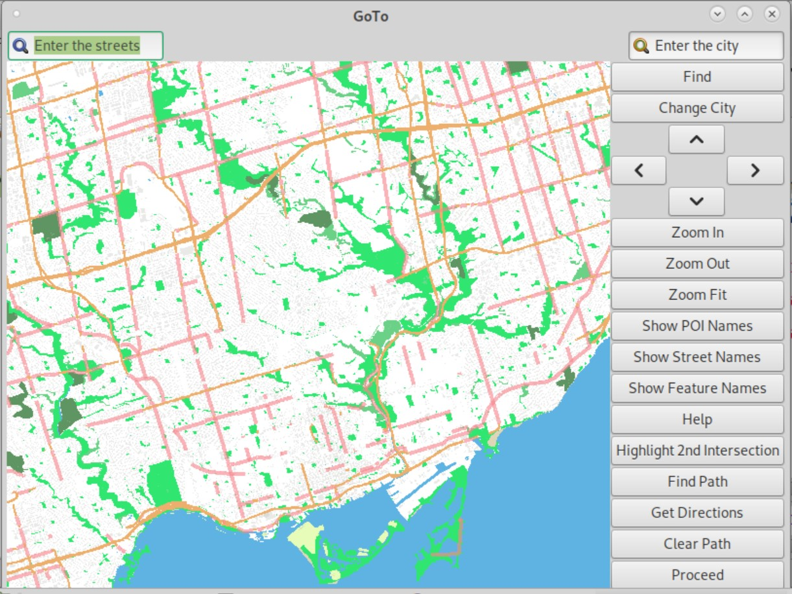
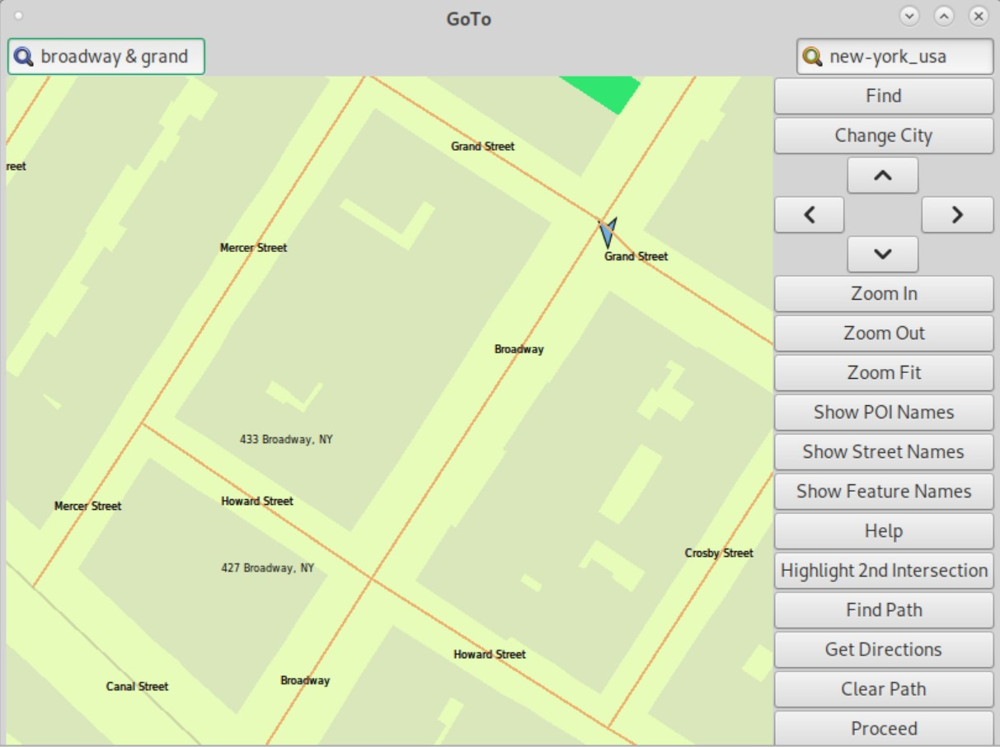
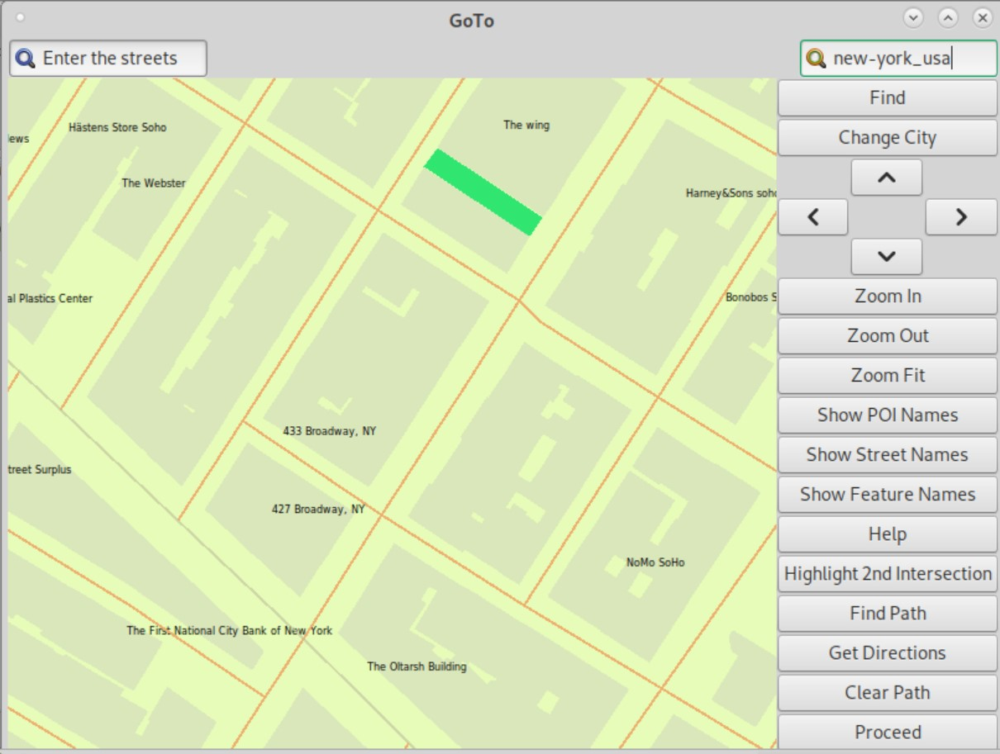
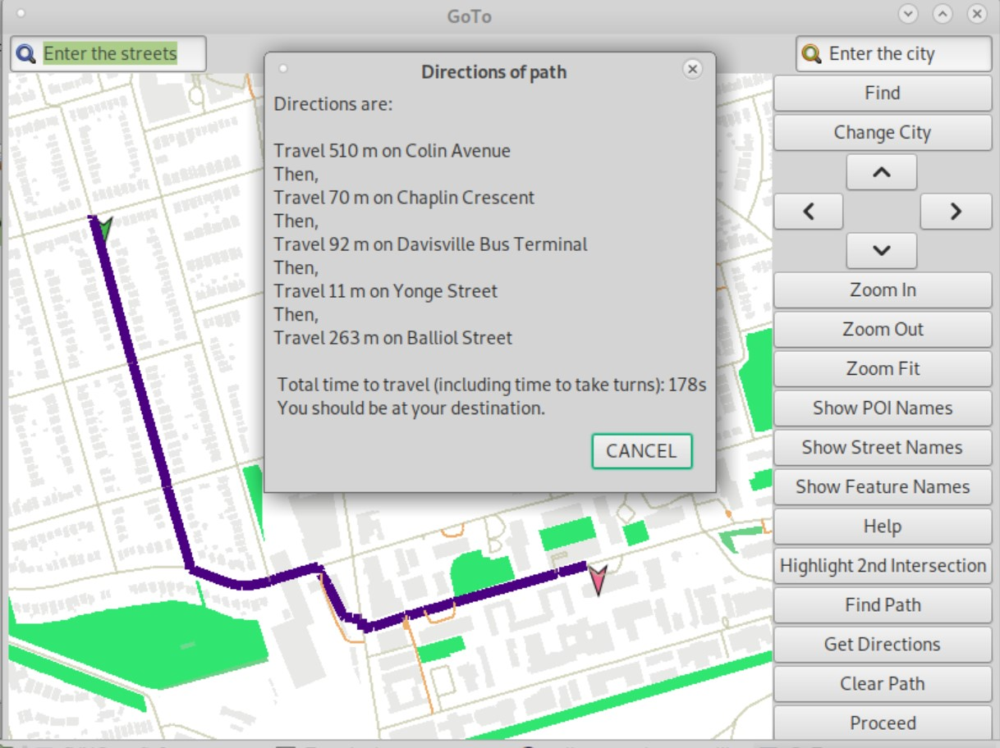
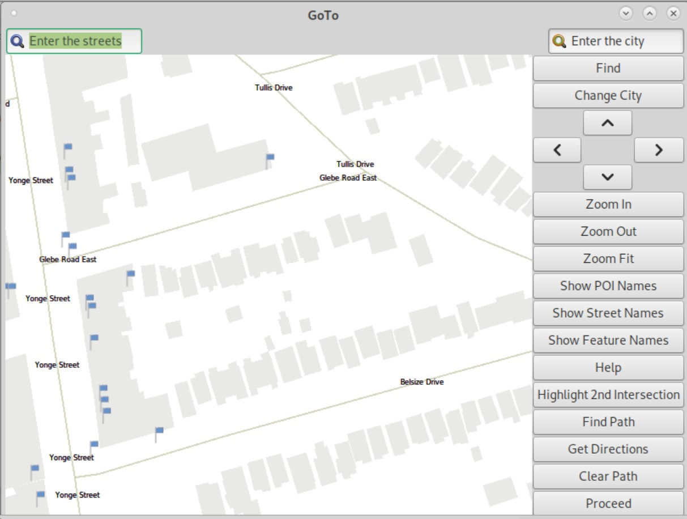
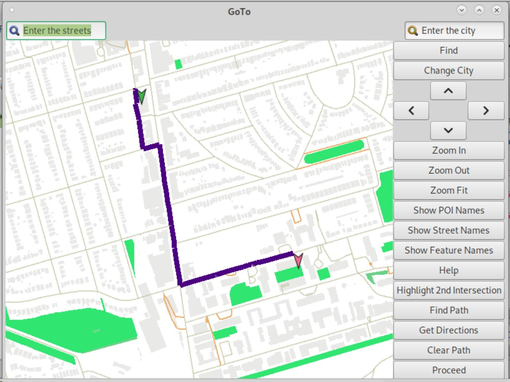

# Mapper

This is C++ program that works as a navigational GIS with a fully working GUI. It uses the A* algorithm for pathfinding and utilizes the Nearest Neighbor algorithm to solve the travelling salesman problem. The graphics have been developed using a course supplied graphics library and Gtk.

It utilizes data obtained from the OpenStreetMap project. 

This is the image of the map opening and loading Toronto by default. 

## Note

This program was developed as part of a course curriculum and that's why the source code hasn't been posted. Please message me if you want to know more or discuss how this application was made. 

## Special features

##### 1. Search box on the top left corner: 
It has dual functionality. If 2 street names are entered, then it highlights the intersection. This search box has in-built error checking, is case insensitive and works with partial names. If 2 locations are entered which do not intersect, then on clicking the "Find Path" button, the shortest path can be visualized. Furthermore, by clicking on the "Find Directions button" the road directions can be obtained. 

Here, the map has been changed to show New York, USA. The area zoomed in is in Broadway. In the top left corner search box, Broadway street and Grand street have been searched and it correctly displays their intersection. 

##### 2. Search box on the top right corner:
City names can be entered and the map closes the current map and loads the new city. 

Here, we can see that the location has been changed to New York, USA. Then, on zooming in and clicking the "Show Feature Names" button, we can see the names of the iconic streets and buildings being displayed. 

##### 3. Buttons for zoom and direction:
These can be used to zoom in the map and move around it. 

We have zoomed in and panned to a random location in Toronto. Then, we highlight 2 intersections and chart the shortest path between these 2 locations. Lastly, after clicking the "Get Directions" button, we can see the text directions and estimated time of travel for our trip. 

##### 4. Buttons for feature, street and points of interests (POI):
Clicking on these buttons display the feature (geographical features like name of park, forest, water body, monuments and famous buildings etc), street/road names, and the names of famous POIs (like restaurants, banks, movie theatres, malls etc) respectively. 

Here, we have zoomed in the map. The small flags are all points of interests and their name can be displayed by clicking on the button. Here, the street names button has been clicked and we can see their names on the map. 

##### 5. Button for highlighting second intersection:
By clicking on this button, the user could select 2 locations on the map and then click on the "Find Path" button to visualize the shortest path between the 2 marked locations. On clicking the "Get Directions" button, the user can get text directions. 

This image shows how the user can select 2 intersections and the shortest path between the 2 intersections is visualized on the map

